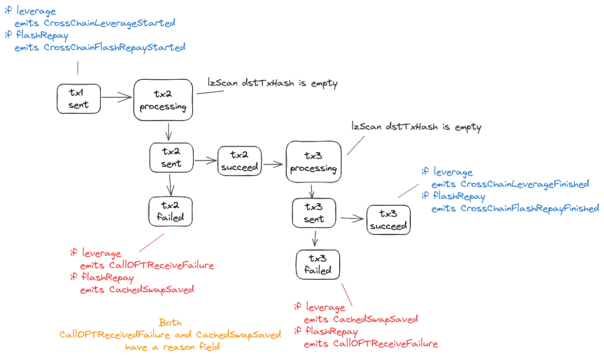

# Introduction

Metronome synth allows using liquidity from another chain in order to execute leverage and flash repay operations. We use LayerZero and Stargate protocols to achieve that.

# LayerZero & Stargate

The Synth cross-chain solution was built on top of the [LayerZero](https://layerzero.gitbook.io/docs/) and [Stargate](https://stargateprotocol.gitbook.io/stargate/) protocols.<br/>
In summary, the `LayerZero` is a set of smart contracts and an off-chain relayer service that reads messages from a source chain and delivers it to the destination chain.<br/>
The `Stargate` extends the basic messaging delivering feature allowing cross-chain token transfers, this is achieved by having pools on each side of a transfer (i.e., the transferred amount is locked on the source chain and unlock on the destination chain).

# Definitions

`CC`: Cross-Chain<br/>
`srcChain`: The source chain (user-facing chain)<br/>
`dstChain`: The destination chain (chain which will use liquidity from)<br/>
`bridgeToken`: A [token supported by Stargate](https://stargateprotocol.gitbook.io/stargate/developers/pool-ids) that will be used by `dstChain`'s swaps<br/>
`LZ`: LayerZero<br/>
`SG`: Stargate<br/>

# Flows

## Leverage flow

- tx1 (user call @ srcChain)

  - Receives `tokenIn` from user (may be the collateral itself or a "naked" token)
  - Mints `syntheticToken` (without drawing any debt)
  - Bridges `syntheticToken` to `dstChain`

- tx2 (swap @ dstChain)

  - Receives `syntheticToken` from `srcChain`
  - Swaps `syntheticToken` for `bridgeToken`
  - Bridges `bridgeToken` to `srcChain`

- tx3 (callback @ srcChain)
  - Receives `bridgeToken`
  - Swaps `tokenIn` and `bridgeToken` for `collateral` (if they aren't the same)
  - Deposits `collateral`
  - Mints `syntheticToken-Debt`

### Leverage flow example

Assuming `0` slippage for the sake of simplicity

`srcChain` = `optimism`<br>
`dstChain` = `mainnet`<br>
`tokenIn` = `vaETH`<br>
`syntheticToken` = `msETH`<br>
`bridgeToken` = `WETH`<br>
`depositToken` = `msdVaETH`<br>
`amountIn` = `10 WETH`<br>
`leverage` = `1.5x`<br>

- tx1 (optimism)

  - Receives 10 vaETH
  - Mints 5 msETH
  - Bridges 5 msETH to mainnet

- tx2 (mainnet)

  - Receives 5 msETH from optimism
  - Swaps 5 msETH for 5 WETH
  - Bridges 5 WETH to optimism

- tx3 (optimism)

  - Receives 5 WETH from mainnet
  - Swaps 5 WETH for 5 vaETH
  - Deposits 15 vaETH
  - Mints 5 msETH-Debt

## Flash repay flow

- tx1 (user call @ srcChain)

  - Withdraws `collateral`
  - Swaps `collateral` for `bridgeToken`
  - Bridges `bridgeToken` to `dstChain`

- tx2 (swap @ dstChain)

  - Receives `bridgeToken` from `srcChain`
  - Swaps `bridgeToken` for `syntheticToken`
  - Bridges `syntheticToken` to `srcChain`

- tx3 (callback @ srcChain)
  - Receives `syntheticToken`
  - Repays debt (If the `syntheticToken` amount is greater than the debt, the surpassing amount is transferred to the user)

**Note**: Unlike `flashRepay()`, the `crossChainFlashRepay()` **doesn't** "flash withdraw" collateral, the user must have enough unlocked balance to withdraw and should care about the healthy of his position during the period of time where the cross-chain operation is on-going (i.e., tx2 and tx3 deliveries/confirmations).

### Flash repay flow example

Assuming `0` slippage for the sake of simplicity

`srcChain` = `optimism`<br/>
`dstChain` = `mainnet`<br/>
`syntheticToken` = `msUSD`<br/>
`depositToken` = `msdVaUSDC`<br/>
`bridgeToken` = `USDC`<br/>
`withdrawAmount` = `1,000 USDC`<br/>

- tx1 (optimism)

  - Withdraws 1,000 vaUSDC
  - Swaps 1,000 vaUSDC for 1,000 USDC
  - Bridges 1,000 USDC to mainnet

- tx2 (mainnet)

  - Receives 1,000 USDC from optimism
  - Swaps 1,000 USDC for 1,000 msUSD
  - Bridges 1,000 msUSD to optimism

- tx3 (optimism)

  - Receives 1,000 msUSD from mainnet
  - Repays debt

# Slippage protection

The CC leverage has two params to avoid losses due to slippage:<br/>
`swapAmountOutMin_` is the minimum output amount for the `syntheticToken->bridgeToken` swap at the `dstChain` (tx2)<br/>
`depositAmountMin_` is the minimum amount for `collateral` deposit (tx3)<br/>

The CC flash repay has three params to avoid losses due to slippage:<br/>
`bridgeTokenAmountMin_` is the minimum output amount for the `collateral->bridgeToken` swap at the `srcChain` (tx1)<br/>
`swapAmountOutMin_` is the minimum output amount for the `bridgeToken->syntheticToken` swap at the `dstChain` (tx2)<br/>
`repayAmountMin_` is the minimum amount for repayment (tx3)<br/>

# Fees

In order to cover the `dstChain` tx gas cost, the `LayerZero` protocol charges a native fee when doing a cross-chain transfer and/or call.<br/>
All native fees are charged from the user, meaning that the CC functions are payable and expect to receive native coin (i.e., `ETH`).<br/>
We have some quote functions to estimate the exact amount the user should pay.<br/>

# Flags and caps

Metronome Synth has some flags and caps related to cross-chain functionalities:

`CrossChainDispatcher.isBridgingActive()`: When `false` all bridging-related activities (synthetic token transfers, CC leverage and CC flash repay) are disabled

`PoolRegistry.isCrossChainFlashRepayActive()`: When `false` the CC flash repay feature is disabled.

`CrossChainDispatcher.isDestinationChainSupported(uint16 lzDstChainId)`: Users can only use the destination chain if it's supported (i.e., return `true`). Note: `lzDstChainId` **isn't** EVM chain's id but the LZ chain's id (Refs: [https://stargateprotocol.gitbook.io/stargate/developers/chain-ids](https://stargateprotocol.gitbook.io/stargate/developers/chain-ids))

`SyntheticToken.maxBridgedInSupply()`: Maximum supply amount that was received from other chains.

`SyntheticToken.maxBridgedOutSupply()`: Maximum supply amount that was sent to other chains.

`SyntheticToken.bridgedInSupply()`: Returns current supply amount that was received from other chains.

`SyntheticToken.bridgedOutSupply()`: Returns current supply amount that was sent to other chains.

# Swapper routings

Both operations perform token swaps, and it's a good idea to ensure that all routings are configured before sending the tx1.

## Leverage routings

**srcChain**: tokenIn -> collateral<br/>
**srcChain**: bridgeToken -> collateral<br/>
**dstChain**: syntheticToken -> bridgeToken<br/>

## Flash repay routings

**srcChain**: collateral -> bridgeToken<br/>
**dstChain**: bridgeToken -> syntheticToken<br/>

# Building calls

## Leverage call

```js
//
// optimism -> mainnet leverage example (ethers v5)
//

// See: https://stargateprotocol.gitbook.io/stargate/developers/chain-ids
const LZ_OP_CHAIN_ID = 111;
const LZ_MAINNET_CHAIN_ID = 101;

const lzArgs = await mainnetQuoter.getLeverageSwapAndCallbackLzArgs(LZ_OP_CHAIN_ID, LZ_MAINNET_CHAIN_ID);
const nativeFee = await opQuoter.quoteCrossChainLeverageNativeFee(await opMsETH.proxyOFT(), lzArgs);
await opSmartFarmingManager.crossChainLeverage(
  OPTIMISM_WETH_ADDRESS, // tokenIn_
  opMsETH.address, // syntheticToken_
  OPTIMISM_WETH_ADDRESS, // bridgeToken_
  opMsdVaETH.address, // depositToken_
  parseUnits("1", 18), // amountIn_
  parseEther("1.5"), // leverage_
  parseUnits("0.49", 18), // swapAmountOutMin_
  parseUnits("1.485", 18), // depositAmountMin_
  lzArgs, // lzArgs_
  {value: nativeFee}
);
```

## Flash repay call

```js
//
// mainnet -> optimism flash repay example (ethers v5)
//

// See: https://stargateprotocol.gitbook.io/stargate/developers/chain-ids
const LZ_MAINNET_CHAIN_ID = 101;
const LZ_OP_CHAIN_ID = 111;

const lzArgs = await opQuoter.getFlashRepaySwapAndCallbackLzArgs(LZ_MAINNET_CHAIN_ID, LZ_OP_CHAIN_ID);
const nativeFee = await mainnetQuoter.quoteCrossChainFlashRepayNativeFee(await mainnetMsUSD.proxyOFT(), lzArgs);
const tx = await mainnetSFM.crossChainFlashRepay(
  mainnetMsUSD.address, // syntheticToken_
  mainnetMsdVaUSDCAddress, // depositToken_
  parseUnits("1000", 18), // withdrawAmount_
  MainnetAddress.USDC_ADDRESS, // bridgeToken_
  parseUnits("999", 6), // bridgeTokenAmountMin_
  parseUnits("998", 18), // swapAmountOutMin_
  parseUnits("997", 18), // repayAmountMin_
  lzArgs,
  {value: nativeFee}
);
```

Notes:

- Note that we have to call both chains' `Quoter` contracts in order to correctly estimate the `nativeFee` for the whole flow<br/>
- The `nativeFee` quote must be called immediately before execution otherwise, tx3's native fee may be outdated when tx2 reaches the `dstChain`.<br/>

# Tracking

## Read state

Each CC operation has a unique id that can be obtained from the `CrossChainLeverageStarted(uint256 indexed id)` and `CrossChainFlashRepayStarted(uint256 indexed id)` event.<br/>
With the id, we can query the state of a CC operation using:<br/>

```js
// CC Leverage data
const {
  dstChainId,
  tokenIn,
  syntheticToken,
  bridgeToken,
  depositToken,
  amountIn,
  debtAmount,
  depositAmountMin,
  account,
  finished,
} = await smartFarmingManager.crossChainLeverages(id);

// CC Flash repay data
const {dstChainId, syntheticToken, repayAmountMin, account, finished} = await smartFarmingManager.crossChainFlashRepays(
  id
);
```

## Flow's transactions



LZ provides an explorer tool (with an [API](https://www.npmjs.com/package/@layerzerolabs/scan-client)), where we can track the cross-chain transactions.<br/>
Example (optimism->mainnet leverage):<br/>

[tx1](https://optimistic.etherscan.io/tx/0x4115e80466e16ed32959291acb5c08675904c2a280e93a3b1ea5dad34a1f2853)<br/>
[tx1->tx2](https://layerzeroscan.com/111/address/0xc2c433d36d7184192e442a243b351a9e3055fd5f/message/101/address/0xf37982e3f33ac007c690ed6266f3402d24aa27ea/nonce/9)<br/>
[tx2](https://etherscan.io/tx/0xd71f699ae14fae74409f52eb44d248bcd3ede577ff3411bb5e111a705d209d1f)<br/>
[tx2->tx3](https://layerzeroscan.com/101/address/0x296f55f8fb28e498b858d0bcda06d955b2cb3f97/message/111/address/0x701a95707a0290ac8b90b3719e8ee5b210360883/nonce/71132)<br/>
[tx3](https://optimistic.etherscan.io/tx/0x933b0bf3ec56d6f2e1d8ce10b4d17816e0df9b4a4786e0add76e8e2e07449993)<br/>

Note: To find the CC transaction at layerzeroscan, search for the hash of one of the transactions (src or dst).

# Recovering from failures

There are several scenarios where the `tx2` or `tx3` may fail. If it happens, we have to address the cause of the failure and then unstuck the transaction by retrying it. Some possible scenarios:

## tx2 (swap)

- some tx2 revert reasons
  - Can't transfer synth due to supply or bridge cap being reached
  - Slippage param is too high, making swap fail
  - The tx2 gas limit setup is lower than needed (e.g., a swapper routing is too gas intensive)
  - The tx3 native fee quickly increased, making the fee sent by the user not enough

Use the functions below to recover from these states:

```solidity
// Retry tx2 at `dstChain.CrossChainDispatcher`

// Leverage
function retrySwapAndTriggerLeverageCallback(
  uint16 srcChainId_,
  bytes calldata srcAddress_,
  uint64 nonce_,
  uint256 amount_,
  bytes calldata payload_,
  uint256 newAmountOutMin_
) external payable;

// Flash Repay
function retrySwapAndTriggerFlashRepayCallback(
  uint16 srcChainId_,
  bytes calldata srcAddress_,
  uint64 nonce_,
  address token_,
  uint256 amount_,
  bytes calldata payload_,
  uint256 newAmountOutMin_
) external payable;
```

Notes:

- CC Leverage: Use the `tx2.CallOFTReceivedFailure` event to check reason and get the function parameters ([failed tx2 example](https://etherscan.io/tx/0xb94f9d7a895eb516c4373d0abd7cc25fcb45bc7ce37fedfbf931126641e41240))
- CC Flash repay: Use the `tx1.Packet`, `tx1.Swap` and `tx2.CachedSwapSaved` events to check the reason and get the function parameters
- If the reason is [swapper slippage failure](https://api.openchain.xyz/signature-database/v1/lookup?function=0x68cc8280&filter=true), the user must update slippage param (`newAmountOutMin_`)
- If the reason is `OutOfFunds`, meaning tx3 native fee is higher than the estimated, the user has to send more ETH through this function
- If the reason is `OutOfGas`, retry will succeed because the retry function doesn't have a gas cap
- There are some scenarios where the protocol governor must act in order to unstuck transactions (e.g., increase caps)
- Any account can call retry functions, but only the user can update his slippage param

## tx3 (callback)

- some tx3 revert reasons
  - Debt token mint fails due to supply cap
  - The tx3 gas limit setup is lower than the needed
  - Slippage param is too high, making deposit or repayment to fail

Use the functions below to recover from these states:

```solidity
// Retry tx3 at `srcChain.SmartFarmingManager`

// Leverage
function retryCrossChainLeverageCallback(
  uint16 srcChainId_,
  bytes calldata srcAddress_,
  uint64 nonce_,
  address token_,
  uint256 amount_,
  bytes calldata payload_,
  uint256 newDepositAmountMin_
) external;

// Flash repay
function retryCrossChainFlashRepayCallback(
  uint16 srcChainId_,
  bytes calldata srcAddress_,
  uint64 nonce_,
  uint256 amount_,
  bytes calldata payload_,
  uint256 newRepayAmountMin_
) external;
```

- CC Leverage: Use the `tx2.Packet`, `tx2.Swap` and `tx2.CachedSwapSaved` events to check reason and get the function parameters [failed tx3 example](https://etherscan.io/tx/0x6d1e01e0101e16525958c8f0b1c4aa73902891ad530214c9d1d6e7e2632188b8)
- CC Flash repay: Use the `tx3.CallOFTReceivedFailure` event to check the reason and get the function parameters
- If the reason is `FlashRepaySlippageTooHigh()` or `FlashRepaySlippageTooHigh()` the user must update slippage param (`newDepositAmountMin_` / `newRepayAmountMin_`)
- If the reason is `OutOfGas`, retry will succeed because the retry function doesn't have gas cap
- There are some scenarios where the protocol governor must act in order to unstuck transactions (e.g., increase caps)
- Any account can call retry functions, but only the user can update his slippage param

### Tooling

Decode custom errors: https://openchain.xyz/tools/abi<br/>
Debug transactions: https://openchain.xyz/trace<br/>
LZ scan API: https://www.npmjs.com/package/@layerzerolabs/scan-client<br/>
